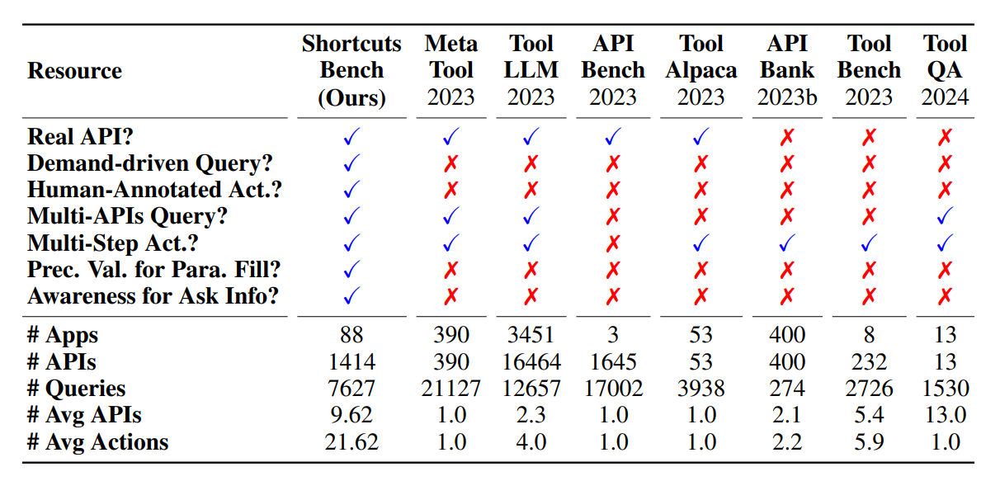

A collection of papers related to API-calling agents and evaluation datasets.

# Methods

## Paper Table

| Paper Name                                                                                     | ArXiv Link                                                               | Published Date |
| :--------------------------------------------------------------------------------------------- | :----------------------------------------------------------------------- | :------------- |
| **APIGen: Automated Pipeline for Generating Verifiable and Diverse Function-Calling Datasets** | [https://arxiv.org/abs/2406.18518v1](https://arxiv.org/abs/2406.18518v1) | June 2024      |
| **AnyTool: Self-Reflective, Hierarchical, and Plug-and-Play LLM for Tool Use**                 | [https://arxiv.org/abs/2402.04253v1](https://arxiv.org/abs/2402.04253v1) | February 2024  |
| **ToolLLM: Facilitating Large Language Models to Master 16000+ Real-World APIs**               | [https://arxiv.org/abs/2307.16789v2](https://arxiv.org/abs/2307.16789v2) | July 2023      |
| **ToolAlpaca: An Instruction-Following Model for Tool Use**                                    | [https://arxiv.org/abs/2306.05301v2](https://arxiv.org/abs/2306.05301v2) | June 2023      |
| **ToolkenGPT: Augmenting Frozen Language Models with Massive Tools via Tool Embeddings**       | [https://arxiv.org/abs/2305.11554v4](https://arxiv.org/abs/2305.11554v4) | May 2023       |
| **Toolformer: Language Models Can Teach Themselves to Use Tools**                              | [https://arxiv.org/abs/2302.04761v1](https://arxiv.org/abs/2302.04761v1) | February 2023  |

## Paper Description

- **APIGen: Automated Pipeline for Generating Verifiable and Diverse Function-Calling Datasets**
  - This paper presents **APIGen**, an automated pipeline designed to synthesize verifiable, high-quality datasets for function-calling applications.
  - APIGen collects 3,673 executable APIs across 21 categories and uses a three-stage hierarchical verification process: format checking, function execution, and semantic verification.
  - Models trained with APIGen's curated datasets demonstrate state-of-the-art performance on the Berkeley Function-Calling Benchmark.
- **AnyTool: Self-Reflective, Hierarchical, and Plug-and-Play LLM for Tool Use**
  - This paper introduces **AnyTool**, a system that uses the function calling feature of GPT-4 for API calls.
  - AnyTool uses a **hierarchical structure** for searching the API pool and a **self-reflection mechanism**.
  - It eliminates the need for training external modules.
- **ToolLLM: Facilitating Large Language Models to Master 16000+ Real-World APIs**
  - This paper introduces **ToolLLM**, a framework for improving the **generalized tool-use ability** of language models.
  - It discusses how to generate **diverse instructions** for tool usage, including single-tool and multi-tool scenarios.
  - **RapidAPI** is used as a source of APIs.
- **ToolAlpaca: An Instruction-Following Model for Tool Use**
  - This paper introduces **ToolAlpaca**, a framework for automated generation of tool-use datasets to enhance the tool-use ability of compact language models.
  - It discusses the construction of a **diverse tool-use corpus**.
  - The framework encompasses 426 distinctive tools from 50 categories, totaling 3938 instances.
- **ToolkenGPT: Augmenting Frozen Language Models with Massive Tools via Tool Embeddings**
  - This paper presents **ToolkenGPT**, a method for enabling LLMs to use tools.
  - It uses a dataset named **KAMEL**, which is a question-answering dataset with facts from Wikidata.
  - ToolkenGPT is applied to different tool use scenarios such as arithmetic tools, database APIs, and robot actions.
- **Toolformer: Language Models Can Teach Themselves to Use Tools**
  - This paper discusses methods for **question answering**.
  - It explores a variety of tools including a question answering system, a search engine, a calculator, a calendar, and a machine translation system.

# Benchmarks

## Paper Table

| Paper Name                                                                                       | ArXiv Link                                                                                        | Published Date |
| :----------------------------------------------------------------------------------------------- | :------------------------------------------------------------------------------------------------ | :------------- |
| **SHORTCUTSBENCH: A Benchmark for Evaluating API-Based Agents**                                  | [https://arxiv.org/abs/2407.00132v2](https://arxiv.org/abs/2407.00132v2)                          | July 2024      |
| **API-BLEND: A Comprehensive Corpora for Training and Benchmarking API LLMs**                    | [https://arxiv.org/abs/2402.15491v2](https://arxiv.org/abs/2402.15491v2)                          | May 2024       |
| **Berkeley Function-Calling Leaderboard**                                                        | [Leaderboard](https://gorilla.cs.berkeley.edu/blogs/8_berkeley_function_calling_leaderboard.html) | August 2024    |
| **METATOOL Benchmark for Large Language Models: Deciding Whether to Use Tools and Which to Use** | [https://arxiv.org/abs/2310.03128v6](https://arxiv.org/abs/2310.03128v6)                          | October 2023   |
| **ToolQA: A Dataset for LLM Question Answering with External Tools**                             | [https://arxiv.org/abs/2306.13304v1](https://arxiv.org/abs/2306.13304v1)                          | June 2023      |
| **API-Bank: A Benchmark for Tool-Augmented LLMs**                                                | [https://arxiv.org/abs/2304.08244v2](https://arxiv.org/abs/2304.08244v2)                          | April 2023     |
| **APIBENCH: A Benchmark for API Recommendation**                                                 | [https://arxiv.org/abs/2112.12653v1](https://arxiv.org/abs/2112.12653v1)                          | December 2021  |

## Paper Description

- **SHORTCUTSBENCH: A Benchmark for Evaluating API-Based Agents**
  - This paper presents **SHORTCUTSBENCH**, a benchmark for evaluating API-based agents.
  - It uses **real APIs** with human-annotated action sequences.
  - It uses **shortcuts** as a series of APIs that an agent can use, and categorizes the shortcuts into different difficulty levels and task types.
- **API-BLEND: A Comprehensive Corpora for Training and Benchmarking API LLMs**
  - This paper introduces **API-BLEND**, a large corpora designed for training and systematically testing tool-augmented LLMs.
  - It focuses on transforming existing datasets into API/Tool-based tasks, addressing API/tool detection, slot filling, and sequencing.
  - API-BLEND includes 10 datasets, with 5 for training and 5 for out-of-domain (OOD) testing, leveraging a hybrid approach of human-annotated datasets and LLM-assisted generation.
- **Berkeley Function-Calling Leaderboard**
  - The Berkeley Function-Calling Leaderboard provides standard benchmark leaderboar for commercial and open models.
  - It includes 2,000 test cases covering a wide range of scenarios, including complex ones like parallel and multiple-function calls.
  - The leaderboard contains diverse API sources like Java, JavaScript, and Python, offering a detailed analysis of each model's ability to interpret and execute commands under different conditions.
- **METATOOL Benchmark for Large Language Models: Deciding Whether to Use Tools and Which to Use**
  - This paper presents **METATOOL**, a benchmark for evaluating LLMs' **tool usage awareness** and **tool selection** capabilities.
  - The benchmark includes a dataset called **TOOLE** with diverse queries designed to trigger LLMs to use tools.
  - METATOOL includes evaluations for tool selection with similar choices, in specific scenarios, with reliability issues, and for multi-tool selection.
- **ToolQA: A Dataset for LLM Question Answering with External Tools**
  - This paper introduces **ToolQA**, a benchmark for evaluating LLMs' ability to use external tools for question answering.
  - The benchmark has a focus on **logical reasoning**, where tools are composed together to solve problems.
  - It uses six contextual dimensions including: temporal, spatial, social, scientific, mathematical, and personal.
- **API-Bank: A Benchmark for Tool-Augmented LLMs**
  - This paper introduces **API-Bank**, a benchmark designed for evaluating **tool-augmented large language models (LLMs)**.
  - It includes a large number of **domains and APIs**, and covers multi-turn and multi-call dialogues.
  - API-Bank evaluates three distinct tool usage abilities: call, retrieve+call, and plan+retrieve+call.
- **APIBENCH: A Benchmark for API Recommendation**
  - This paper introduces **APIBENCH**, a benchmark for evaluating **API recommendation** techniques.
  - It categorizes API recommendation into **query-based** and **code-based** approaches.
  - APIBENCH includes datasets for both query-based and code-based API recommendation using Java and Python.

